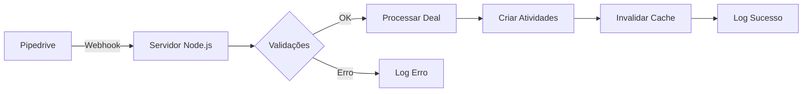

# 🏢 Automação de Registro de Imóveis

Sistema automatizado para gerenciamento de atividades de registro de imóveis integrado ao Pipedrive.


## 📋 Índice

- **[Recursos](#-recursos)**
- **[Requisitos](#-requisitos)**
- **[Instalação](#-instalação)**
- **[Configuração](#-configuração)**
- **[Uso](#-uso)**
- **[Arquitetura](#-arquitetura)**
- **[Contribuição](#-contribuição)**
- **[Notas de Versão](#-notas-de-versão)**
- **[Licença](#-licença)**
- **[Suporte](#-suporte)**

## 🚀 Recursos

- **✅ Integração completa com Pipedrive API**
- **✅ Criação automática de atividades baseada em cronograma**
- **✅ Webhook para atualizações em tempo real**
- **✅ Sistema anti-flood com debounce e rate limiting**
- **✅ Monitoramento inteligente de campos específicos**
- **✅ Controle de proprietário dinâmico (owner)**
- **✅ Cache otimizado para performance**
- **✅ Validação robusta de status e condições**
- **✅ Sistema de logs estruturado**
- **✅ Tratamento de atividades condicionais**
- **✅ Configuração segura via variáveis de ambiente**

## 📋 Requisitos

- **Node.js**: v22.23.0 ou superior
- **NPM**: 10.9.3 ou superior
- **Pipedrive**: Conta com acesso à API
- **Permissões**: Habilitar e configurar webhooks
- **Express.js**: Framework web para webhook

## 💻 Instalação

1. Clone o repositório:
```bash
git clone [url-do-repositorio]
cd Atividades-de-Registro
```

2. Instale as dependências:
```bash
npm install
```

3. Configure as variáveis de ambiente:
```bash
cp .env.example .env
# Edite o arquivo .env com suas configurações
```

## ⚙️ Configuração

1) Configure suas variáveis de ambiente no arquivo `.env`:

```env
# Configurações essenciais do Pipedrive
PIPEDRIVE_TOKEN=seu_token_aqui
PIPEDRIVE_API=https://api.pipedrive.com/v1

# IDs dos campos customizados (obter no Pipedrive)
CAMPO_DATA_INICIO_REGISTRO=d04018fd5ac9c09019c1e22792c4062f04f17756
CAMPO_STATUS_REGISTRO=6c8f6355237b0ae3d21972c1db9073cea458b1db
CAMPO_DATA_TERMINO_CONTRATOS=f7eba1ca53326f57f7e2d5da4d4fe9d155e99651
CAMPO_DATA_TERMINO_ITBI=069bf183917fb89a77a63f5cf793db5c7a2b2c48
CAMPO_DATA_VENCIMENTO=7cef45d16b6eb3df21c11165138fab5437f05ef7

# Configurações do sistema
DEAL_ID_TESTE=11176
TIPO_ATIVIDADE=Averbações
HORARIO_PADRAO=09:00

# IDs das opções de status (obter no Pipedrive)
OPTION_ID_FINALIZADO=206
OPTION_ID_INICIAR=343

# Configuração do servidor
PORT=3000
```

2) Garanta que os seguintes campos existam no Pipedrive:
- **📅 Data Início Registro** (novo campo principal)
- **🏠 Data Término Contratos**
- **🏛️ Data Término ITBI**
- **📋 Status Registro**
- **⏰ Data Vencimento Protocolo Registro**

## 🎯 Uso

### Executando localmente

1. **Teste a configuração:**
```bash
node main_node.js
```

2. **Inicie o servidor webhook:**
```bash
node webhook.js
```

3. **URLs disponíveis:**
   - Webhook: `http://localhost:3000/webhook`
   - Status: `http://localhost:3000/status`
   - Teste: `http://localhost:3000/test/{dealId}`

### Implantação em produção

1. **Configure webhook no Pipedrive:**
   - Acesse **Configurações > Webhooks**
   - URL: `https://seu-dominio.com/webhook`
   - Eventos: `updated.deal`, `added.deal`

2. **Deploy em servidor:**
   ```bash
   # Exemplo com PM2
   npm install -g pm2
   pm2 start webhook.js --name "registro-webhook"
   pm2 startup
   pm2 save
   ```

### Cronograma de atividades

O sistema cria automaticamente **12 atividades** baseadas na **Data Início Registro**:

| Dia | Atividade | Prioridade | Descrição |
|-----|-----------|------------|-----------|
| 1 | INICIAR | Alta | Conferir documentos e protocolar |
| 3 | VERIFICAR PROTOCOLO | Média | Checar abertura e status |
| 5 | VERIFICAR PROTOCOLO | Média | Acompanhar análise |
| 7 | STATUS DO ANDAMENTO | Média | Monitorar progresso |
| 10 | VERIFICAR DEVOLUTIVA | Alta | Confirmar notas devolutivas |
| 12 | VERIFICAR PAGAMENTOS | Média | Liberar custos cartorários |
| 14 | ACOMPANHAR CARTÓRIO | Alta | Reforçar contatos |
| 16 | PRAZO PRÓXIMO | Alta | Verificar emolumentos |
| 18 | PRAZO ESTOURANDO | Alta | Resolver pendências |
| 20 | DESCUMPRIMENTO | Alta | Avaliar prorrogação |
| 25 | DESCUMPRIMENTO TOTAL | Alta | Verificar cancelamento |
| 30 | PRAZO FINAL/CRÍTICO | Alta | Cobrança formal |

### Fluxo de trabalho

1) **Condições para criar atividades:**
   - ✅ Status = "01. Iniciar"
   - ✅ Data Término Contratos preenchida
   - ✅ Data Término ITBI preenchida
   - ✅ Data Início Registro preenchida

2) **Sistema de proteção:**
   - Anti-flood: evita payloads duplicados
   - Debounce: 60s entre processamentos do mesmo deal
   - Rate limiting: máximo 30 requisições/minuto
   - Cache inteligente: otimiza consultas à API

3) **Logs estruturados:**
   - Todas as execuções são logadas
   - Controle de erros detalhado
   - Rastreamento de atividades criadas

## 🏗 Arquitetura

### Estrutura de arquivos

```
├── main_node.js     # Lógica principal e funções core
├── webhook.js       # Servidor Express com webhook do Pipedrive
├── .env             # Variáveis de ambiente (não versionado)
├── .env.example     # Template de configuração
├── package.json     # Dependências e scripts
└── README.md        # Documentação
```

### Componentes principais

- **🧠 Main Node**: Funções core, cache, validações e criação de atividades
- **🔗 Webhook**: Servidor Express com anti-flood, debounce e rate limiting
- **⚙️ Config**: Gerenciamento de variáveis de ambiente
- **📊 Logs**: Sistema estruturado de logs e monitoramento
- **🔒 Cache**: Otimização de performance com cache em memória

### Fluxo de dados



## 📝 Notas de Versão

### v2.0.0 ✨ (Versão Atual)
- ✅ **Sistema completo de automação finalizado**
- ✅ Cronograma de 12 atividades baseado em Data Início
- ✅ Anti-flood, debounce e rate limiting implementados
- ✅ Cache otimizado para performance
- ✅ Owner ID dinâmico e validações robustas
- ✅ Sistema de logs estruturado
- ✅ Servidor Express para webhook
- ✅ Suporte a atividades condicionais

### v1.0.0
- Integração inicial com Pipedrive
- Sistema de webhook básico
- Automação baseada em datas
- Controle de notas devolutivas

## 📄 Licença

Este projeto está sob a licença MIT. Veja o arquivo [LICENSE](LICENSE) para mais detalhes.

## 🙋‍♂️ Suporte

Para suporte e questões, por favor abra uma [issue](issues) no repositório.

---

**🎉 Automação concluída e funcionando em produção!**

Desenvolvido com ❤️ para otimizar o processo de registro de imóveis


